<div align="center">
  
</div>

# AI Art Prompt Builder

> **A unified, dual-layer creative prompt studio: a reactive React 19 web application and an in-sheet Google Apps Script engine with columnar databases, real-time formula generation, and agent-callable APIs.**

[](https://github.com/traikdude/AI-Art-Prompt-Builder/actions/workflows/ci.yml)


[](LICENSE)

[⚡ Quick Start](#-quick-start--local-setup) · [🏗️ Architecture](#-system-architecture) · [✨ Features](#-key-features) · [📊 In-Sheet Studio](#-google-sheets-dynamic-studio) · [🌐 Web App API](#-web-app-api--endpoints) · [🛡️ CI Gates](#-ci--automated-verification)

---

## 📖 Overview

**AI Art Prompt Builder** solves the prompt-engineering bottleneck for digital artists, creative teams, and autonomous AI agents. Instead of hand-assembling fragmented descriptions for Midjourney, Stable Diffusion, DALL-E, Flux, or Imagen, the system coordinates **1,173+ curated vocabulary entries** across Character, Scene, and Camera parameters.

The platform operates across two complementary environments:

1. **Modern React 19 Web Studio**: A high-performance web interface built with Vite and TypeScript, featuring dynamic theme switching, Gemini AI-powered palette imports, real-time audio feedback, and instant multi-format prompt generation.
2. **Google Sheets Dynamic Studio**: A spreadsheet-native command center (`PROMPT_BUILDER`) powered by Google Apps Script, featuring contiguous columnar reference databases (`DB_Character`, `DB_Scene`, `DB_Camera`), parenthesis-safe multi-select dropdowns, real-time formula prompt assembly, and Discord/Midjourney character safety counters.
3. **Agent-Callable Web App API**: A deployed Apps Script JSON endpoint (`doGet`/`doPost`) with sub-15ms cached responses allowing autonomous AI agents, CLI swarms, and rendering pipelines to programmatically fetch categories or assemble prompts.

---

## 📑 Table of Contents

- [Overview](#-overview)
- [System Architecture](#-system-architecture)
- [Key Features](#-key-features)
- [Project Structure](#-project-structure)
- [Tech Stack](#-tech-stack)
- [Google Sheets Dynamic Studio](#-google-sheets-dynamic-studio)
- [Web App API & Endpoints](#-web-app-api--endpoints)
- [NotebookLM & Automation CLI](#-notebooklm--automation-cli)
- [Quick Start & Local Setup](#-quick-start--local-setup)
- [Configuration](#-configuration)
- [CI & Automated Verification](#-ci--automated-verification)
- [Repository Freshness & Maintenance](#-repository-freshness--maintenance)
- [Contributing & Agent Rules](#-contributing--agent-rules)
- [License](#-license)

---

## 🏗️ System Architecture

The following diagram illustrates the data flow between the React client, Google Sheets columnar store, Google Apps Script backend, and external agent consumers:

```mermaid
flowchart TD
    subgraph Frontend["🎨 React 19 Web Application (Vite + TS)"]
        UI["React UI (App.tsx)\nThemes · Audio · Multi-Format"]
        SS["sheetService.ts\nCSV Parser + API Fallback"]
        GS["geminiService.ts\n@google/genai SDK"]
        UI <--> SS
        UI <--> GS
    end

    subgraph GoogleCloud["☁️ Google Workspace & Apps Script"]
        subgraph Spreadsheet["📊 Google Spreadsheet (ID: 1Gxj0Vf...)"]
            DBC["DB_Character\n(8 cols, 161 rows)"]
            DBS["DB_Scene\n(6 cols, 357 rows)"]
            DBK["DB_Camera\n(6 cols, 315 rows)"]
            Studio["PROMPT_BUILDER\nIn-Sheet Studio Sheet"]
            Media["Media Studio Tabs\n🌐 Web_Resources · 🖼️ Artwork_Registry\n📅 Production_Queue · 🧠 NotebookLM_Sync"]
            Log["History/Log\nUnified Selections Audit"]
        end

        subgraph Backend["⚙️ Apps Script Backend (Deployment @25)"]
            Code["Code.js\nonEdit multi-select · menus"]
            Drive["DriveUrlIndexer.js\nDrive crawler · =IMAGE() · NotebookLM"]
            Api["Api.js\nJSON Web App API (@25)"]
            Dash["Dashboard_v5_0_ENHANCED.html\nIn-Sheet Modal Studio"]
        end
    end

    subgraph External["🤖 AI Agents & External Consumers"]
        Agents["Autonomous Agents / CLI Swarms\n(Codex · Claude · Antigravity)"]
        Curl["curl / Automation Scripts"]
        GDrive["📁 Google Drive Artwork Store"]
        NBLM["🧠 Google NotebookLM"]
        CLI["scripts/sync_notebooklm_art_sources.py\nRAG & Queue CLI"]
    end

    subgraph CI["🛡️ Continuous Integration (GitHub Actions)"]
        Gate["ci.yml\nTypecheck · Build · Reachability Gate"]
    end

    %% Data Connections
    SS -- "1. Google Visualization CSV (/gviz/tq)" --> DBC & DBS & DBK
    SS -- "2. JSON Fallback (?action=categories)" --> Api
    GS -- "AI Palette Expansion" --> GeminiCloud["Gemini API (2.5-flash)"]
    
    Code <--> Studio
    Code --> Log
    Drive <--> Media
    Drive -. "Crawl & Thumbnail" .-> GDrive
    Drive -. "Research Sync" .-> NBLM
    CLI -- "POST Ingest & Enqueue" --> Api
    DBC & DBS & DBK --> Studio
    
    Api -- "Cached JSON Payload" --> Agents
    Api -- "JSON Endpoints" --> Curl

    Gate -- "npm run test:reachability" --> Spreadsheet
    Gate -- "Verify HTTP 200 & Categories" --> Api
```



---

## ✨ Key Features

- **Dual-Interface Creative Studio**: Work inside an interactive web browser or directly inside your Google Sheets workflow without switching windows.
- **Normalized Columnar Databases**: Clean, row-1 header reference tables (`DB_Character`, `DB_Scene`, `DB_Camera`) eliminate blank-cell offsets and missing dropdown options.
- **Parenthesis-Safe Multi-Select Dropdowns**: In-sheet dropdowns support selecting multiple traits per row, using depth-counting string parsers that preserve commas inside descriptive items like `Apocalyptic Survivor (Gas mask, Worn-out coat)`.
- **Toggle-Off Deselection**: Re-selecting an active trait removes it; selecting an unchosen trait appends it to the list.
- **Interactive Multi-Select Sidebar**: Built-in Apps Script sidebar (`🎨 AI Prompt Builder` → `Multi-Select Trait Studio`) allows rapid checkbox configuration across all 20 categories with 1-click sheet sync.
- **Multi-Format Compilation**: Instant output in narrative, technical, poetic, bulleted, or structured JSON formats.
- **Real-Time Safety & Length Indicators**: In-sheet status bar provides character counts and safety verifications against Discord (2,000 character limit) and Midjourney constraints.
- **Gemini AI Palette Expansion**: Integrated `@google/genai` connection to dynamically brainstorm new character archetypes, lighting setups, or camera rigs.
- **Customizable Themes & Audio**: Seven distinct UI themes (Neon, Dark, Pastel, Ocean, Sunset, Forest, Candy) with optional sound effects.
- **Sub-15ms Cached Web App API**: High-speed JSON endpoints for category introspection and programmatic prompt compilation.
- **Universal Media Studio & Production Automation**:
  - **Inspiration Web Directory (`🌐 Web_Resources`)**: Curated catalogue of AI generation portals, style dictionaries, and prompt engineering references with categorized URLs and descriptions.
  - **Google Drive Artwork Registry (`🖼️ Artwork_Registry`)**: Automated image indexing engine with dynamic `=IMAGE()` thumbnail previews, resolution/aspect metadata, generation engine tags, and full file IDs.
  - **Batch Production Schedule Queue (`📅 Production_Queue`)**: Priority-ranked rendering pipeline tracker with engine targeting (Midjourney, Flux, SDXL, Imagen 3), aspect ratio specs, seed logging, and completion status validation.
  - **Google NotebookLM Research & Knowledge Sync (`🧠 NotebookLM_Sync`)**: Direct synchronization tracking for art history lore, master artist styles, and prompt vocabulary documents mapped directly to NotebookLM IDs.
  - **Automated Scheduled Crawlers**: Built-in 6:00 AM daily trigger installer (`installDailyDriveArtworkTrigger`) and manual `syncDriveArtworkIndex()` crawler to keep Drive references fresh.

---

## 📁 Project Structure

```text
AI-Art-Prompt-Builder/
├── .github/
│   └── workflows/
│       └── ci.yml               # GitHub Actions: Typecheck, build, and reachability gate
├── appscript/                   # Google Apps Script codebase (clasp tracked)
│   ├── .clasp.json              # Clasp project bindings (scriptId: 1cu3shbnqq...)
│   ├── Api.js                   # Web App doGet/doPost REST endpoint handlers
│   ├── appsscript.json          # Apps Script manifest and runtime configuration
│   ├── Archive.js               # Legacy sheet deprecation and backup routines
│   ├── Code.js                  # Core sheet engine, onEdit multi-select, studio setup
│   ├── Dashboard_v5_0_ENHANCED.html # In-sheet HTML modal dashboard
│   ├── DriveUrlIndexer.js       # Drive media crawler, =IMAGE() indexing, daily triggers, and NotebookLM sync
│   ├── GOALS.md                 # Goal OS active ledger and milestone tracker
│   ├── help.html                # Modal help and keyboard shortcuts guide
│   ├── Migration.js             # Columnar database migration and cleanup utilities
│   ├── Video.js                 # Video prompt generation and camera movement models
│   ├── docs/                    # Architectural decisions, video data model, shot designs
│   └── tools/                   # Previz automation and Blender/DaVinci smoke scripts
├── docs/
│   └── assets/
│       └── banner-brief.md      # Art direction brief, prompts, and maintainability spec
├── scripts/
│   ├── sync_notebooklm_art_sources.py # Universal CLI for NotebookLM knowledge and queue sync
│   └── verify-endpoints.js      # Live endpoint reachability test script (Node 22)
├── services/
│   ├── geminiService.ts         # Google GenAI SDK integration for palette brainstorming
│   └── sheetService.ts          # Resilient CSV parser & Web App API fallback client
├── App.tsx                      # Main React application component & theme management
├── index.html                   # HTML entry point with modern web fonts
├── index.tsx                    # React DOM root mounting
├── metadata.json                # Web app manifest and Jules metadata
├── package.json                 # Node.js dependencies, scripts, and type definitions
├── tsconfig.json                # TypeScript compiler configuration
├── types.ts                     # Core domain types (AppData, Category, SectionName)
└── vite.config.ts               # Vite bundler configuration with React plugin
```

---

## 💻 Tech Stack

| Layer | Technology | Purpose |
|---|---|---|
| **Web Frontend** | React 19.2, TypeScript 5.8 | Modern reactive user interface and state management |
| **Bundler & Tooling** | Vite 6.2, Node.js 22 LTS | Fast development server and optimized production builds |
| **Generative AI** | `@google/genai` (Gemini 2.5) | Dynamic palette brainstorming and vocabulary expansion |
| **Spreadsheet Backend** | Google Apps Script (V8) | Sheet automation, dynamic formulas, multi-select `onEdit` triggers |
| **Data Store** | Google Sheets Columnar DB | 1,173+ normalized entries in `DB_Character`, `DB_Scene`, `DB_Camera` |
| **Deployment & CI** | Clasp CLI, GitHub Actions | Continuous deployment to Apps Script and daily endpoint reachability gates |

---

## 📊 Google Sheets Dynamic Studio

The companion spreadsheet functions as a standalone prompt engineering environment:

- **Spreadsheet ID**: `1Gxj0VfgtkqtTicsjK2_2Gx5sOXK8L3PJtI2-yKjftOE`
- **Active Studio Sheet**: `PROMPT_BUILDER`
- **Active Reference Sheets**:
  - `DB_Character`: 8 categories (Gender, Age, Body Type, Hair, Clothing, Expression, Pose, Archetype)
  - `DB_Scene`: 6 categories (Environment, Time of Day, Weather, Lighting, Architecture, Era)
  - `DB_Camera`: 6 categories (Shot Type, Camera Angle, Lens, Framing, Motion, Color Grading)
- **Active Media Studio Sheets**:
  - `🌐 Web_Resources`: Curated directory of AI art platforms, style databases, and prompt tools (10 starter links)
  - `🖼️ Artwork_Registry`: Automated Google Drive image index with `=IMAGE()` thumbnail previews, tags, and engine specs
  - `📅 Production_Queue`: Batch generation queue with engine target, aspect ratio, seed, and status validation dropdowns
  - `🧠 NotebookLM_Sync`: Knowledge registry linking artistic styles, lore, and prompt vocabularies to Google NotebookLM
  - `History/Log`: Unified selection history log (`Category | Value | Source | Timestamp`)

### In-Sheet Studio Setup
From the Google Sheets top menu bar:
1. Click **`🎨 AI Prompt Builder`**:
   - **`🚀 Setup / Reset Studio Sheet`** to refresh data validations, dynamic formulas, and length counters.
   - **`🧩 Multi-Select Trait Studio`** to open the sidebar for rapid multi-category editing.
   - **`📊 Open Interactive Dashboard`** to open the pre-cached modal dashboard.
2. Click **`📁 Media Studio & Automation`**:
   - **`🚀 1-Click Setup All Media Studio Sheets`**: Initializes all 4 Media Studio sheets with headers, formatting, and validation.
   - **`🔄 Sync Google Drive Artwork Now`**: Recursively indexes images from your designated Google Drive folder.
   - **`⏰ Install 6:00 AM Daily Drive Indexer`**: Configures a daily background time-driven trigger for hands-free indexing.
   - **`⚙️ Configure Drive Folder ID`** / **`⚙️ Configure NotebookLM Notebook ID`**: Persists root IDs directly into `ScriptProperties`.

---

## 🌐 Web App API & Endpoints

The Apps Script backend exposes high-reliability public endpoints deployed at:

```text
https://script.google.com/macros/s/AKfycbyCjig1ociubkgrGw5P814n3aX1pQvzM4N5erySJWTJijL2oQW9ZfBZDUvwohLxHmyjNw/exec
```

### 1. Health Check
```bash
curl -L "https://script.google.com/macros/s/AKfycbyCjig1ociubkgrGw5P814n3aX1pQvzM4N5erySJWTJijL2oQW9ZfBZDUvwohLxHmyjNw/exec?action=health"
```
**Response**: `{"ok": true, "timestamp": "...", "version": "5.6.0"}`

### 2. Fetch All Categories
```bash
curl -L "https://script.google.com/macros/s/AKfycbyCjig1ociubkgrGw5P814n3aX1pQvzM4N5erySJWTJijL2oQW9ZfBZDUvwohLxHmyjNw/exec?action=categories"
```
Returns a cached JSON object grouped by `character`, `scene`, and `camera`.

### 3. Generate Formatted Prompt
```bash
curl -L "https://script.google.com/macros/s/AKfycbyCjig1ociubkgrGw5P814n3aX1pQvzM4N5erySJWTJijL2oQW9ZfBZDUvwohLxHmyjNw/exec?action=prompt&character.Gender=Female&scene.Lighting=Volumetric&camera.Shot%20Type=Cinematic%20Close-Up&formats=true"
```
Returns narrative, technical, poetic, bulleted, and raw prompt strings along with character safety metrics.

### 4. Media Studio Data Endpoints
```bash
# Fetch curated web resources (table rows as JSON)
curl -L "https://script.google.com/macros/s/AKfycbyCjig1ociubkgrGw5P814n3aX1pQvzM4N5erySJWTJijL2oQW9ZfBZDUvwohLxHmyjNw/exec?action=resources"

# Fetch artwork registry catalogue
curl -L "https://script.google.com/macros/s/AKfycbyCjig1ociubkgrGw5P814n3aX1pQvzM4N5erySJWTJijL2oQW9ZfBZDUvwohLxHmyjNw/exec?action=artwork"

# Fetch active production schedule queue
curl -L "https://script.google.com/macros/s/AKfycbyCjig1ociubkgrGw5P814n3aX1pQvzM4N5erySJWTJijL2oQW9ZfBZDUvwohLxHmyjNw/exec?action=queue"

# Fetch NotebookLM synchronization records
curl -L "https://script.google.com/macros/s/AKfycbyCjig1ociubkgrGw5P814n3aX1pQvzM4N5erySJWTJijL2oQW9ZfBZDUvwohLxHmyjNw/exec?action=notebooklm"

# Master setup trigger (Initializes all 4 tabs via Web App)
curl -L "https://script.google.com/macros/s/AKfycbyCjig1ociubkgrGw5P814n3aX1pQvzM4N5erySJWTJijL2oQW9ZfBZDUvwohLxHmyjNw/exec?action=setup_media_studio"

# Trigger background Drive indexing
curl -L "https://script.google.com/macros/s/AKfycbyCjig1ociubkgrGw5P814n3aX1pQvzM4N5erySJWTJijL2oQW9ZfBZDUvwohLxHmyjNw/exec?action=sync_drive_artwork"
```

---

## 🧠 NotebookLM & Automation CLI

The repository includes a dedicated cross-platform CLI tool ([`scripts/sync_notebooklm_art_sources.py`](scripts/sync_notebooklm_art_sources.py)) adapted from the enterprise Morrison1 engine to synchronize research notes, art theory monographs, and prompt vocabulary into Google NotebookLM and the Google Sheet:

```bash
# 1. List all active synchronized NotebookLM knowledge sources
python scripts/sync_notebooklm_art_sources.py --list

# 2. Ingest explicit research concepts
python scripts/sync_notebooklm_art_sources.py --sources "Atmospheric Light Scattering" "Surrealist Juxtapositions"

# 3. Synchronize a local Markdown art theory monograph
python scripts/sync_notebooklm_art_sources.py --file docs/art-theory/chiaroscuro.md

# 4. Recursively scan a folder of research notes
python scripts/sync_notebooklm_art_sources.py --dir docs/

# 5. Enqueue a production batch task
python scripts/sync_notebooklm_art_sources.py --enqueue "Hyper-Realistic Cyber Lotus" --engine "Flux.1 Dev" --ratio "16:9 (Landscape)" --prompt "luminescent cyber lotus floating on dark liquid mercury, volumetric god rays"

# 6. Configure NotebookLM Notebook ID / URL
python scripts/sync_notebooklm_art_sources.py --set-notebook "https://notebooklm.google.com/notebook/your-notebook-id"
python scripts/sync_notebooklm_art_sources.py --get-notebook
```

---

## ⚡ Quick Start & Local Setup

### Prerequisites
- **Node.js**: v22 LTS or later
- **npm**: v10 or later

### Installation

1. Clone the repository:
   ```bash
   git clone https://github.com/traikdude/AI-Art-Prompt-Builder.git
   cd AI-Art-Prompt-Builder
   ```

2. Install dependencies:
   ```bash
   npm install
   ```

3. Configure environment variables:
   ```bash
   cp .env.example .env.local
   ```
   Add your Gemini API key to `.env.local`:
   ```env
   GEMINI_API_KEY=your_gemini_api_key_here
   ```

4. Start the development server:
   ```bash
   npm run dev
   ```

5. Build for production:
   ```bash
   npm run build
   ```

---

## 🛡️ CI & Automated Verification

The repository runs an automated endpoint reachability and build gate on every commit and on a daily schedule (`0 6 * * *`):

```bash
# Run full verification suite (TypeScript check + live endpoint test)
npm test

# Run reachability verification only
npm run test:reachability
```

The reachability test verifies:
- Physical cell existence and headers for `DB_Character`, `DB_Scene`, and `DB_Camera` via Google Visualization CSV queries.
- Instant HTTP 200 and category payloads from the deployed Apps Script Web App API.

---

## 🔄 Repository Freshness & Maintenance

| Surface | Authority / Source | Refresh Trigger |
|---|---|---|
| **Web Frontend** | `App.tsx`, `services/` | UI changes, theme updates, or Gemini SDK revisions |
| **In-Sheet Studio** | `appscript/Code.js` | Changes to formula structure, onEdit triggers, or menu items |
| **Columnar DBs** | Google Sheets (`DB_*` tabs) | Vocabulary additions or category reorganizations |
| **Web App API** | `appscript/Api.js` | Endpoint parameter changes or format additions (requires `clasp deploy`) |
| **Endpoint Gate** | `scripts/verify-endpoints.js` | Changes to spreadsheet IDs, tab names, or API response schemas |
| **Hero Banner** | `docs/assets/banner-brief.md` | Major UI design or branding revisions |

---

## 🤝 Contributing & Agent Rules

- Operational guidelines for autonomous coding agents are maintained in [`AGENTS.md`](AGENTS.md).
- Standing merge authorization follows `POLICY_MERGE_AUTHORITY.md` (`MERGE-AUTHORITY-2026-09-07`).
- Never push untested code to Google Apps Script. Always verify syntax with `node -c` and run `npm test` locally before publishing new versions.

---

## 📄 License

This project is licensed under the MIT License — see the [LICENSE](LICENSE) file for details.